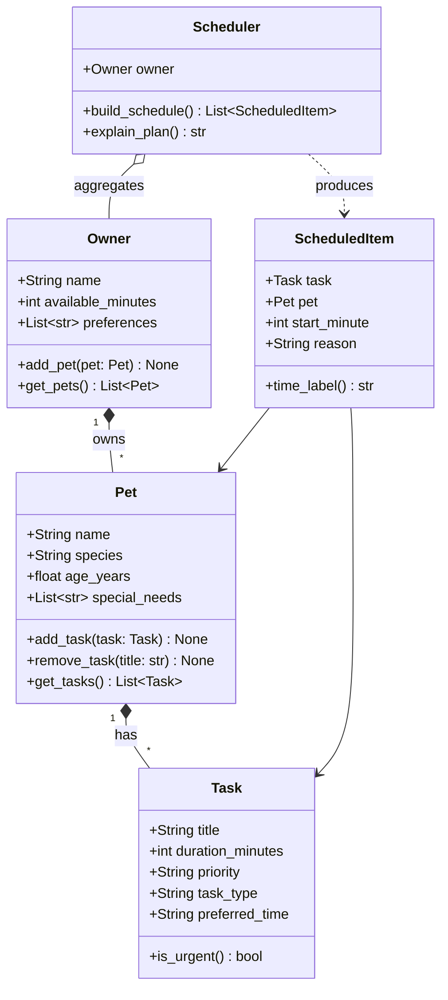

# PawPal+ UML Class Diagram

```mermaid
classDiagram
    class Owner {
        +String name
        +int available_minutes
        +List~str~ preferences
        +add_pet(pet: Pet) None
        +get_pets() List~Pet~
    }

    class Pet {
        +String name
        +String species
        +float age_years
        +List~str~ special_needs
        +add_task(task: Task) None
        +remove_task(title: str) None
        +get_tasks() List~Task~
    }

    class Task {
        +String title
        +int duration_minutes
        +String priority
        +String task_type
        +String preferred_time
        +is_urgent() bool
    }

    class Scheduler {
        +Owner owner
        +build_schedule() List~ScheduledItem~
        +explain_plan() str
    }

    class ScheduledItem {
        +Task task
        +Pet pet
        +int start_minute
        +String reason
        +time_label() str
    }

    Owner "1" *-- "*" Pet : owns
    Pet "1" *-- "*" Task : has
    Scheduler o-- Owner : aggregates
    Scheduler ..> ScheduledItem : produces
    ScheduledItem --> Task
    ScheduledItem --> Pet
```
